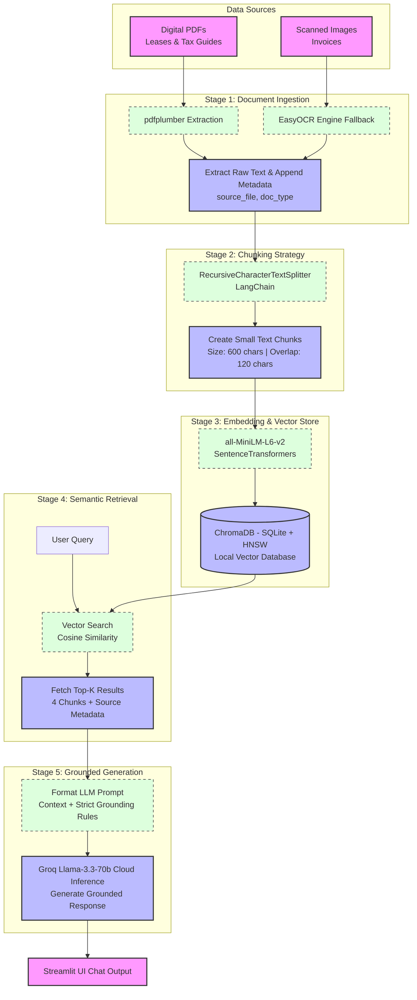

# Project 1 Planning: The Unofficial Guide

> Write this document before you write any pipeline code.
> Your spec and architecture diagram are what you'll use to direct AI tools (Claude, Copilot, etc.) to generate your implementation — the more specific they are, the more useful the generated code will be.
> Update the Retrieval Approach and Chunking Strategy sections if you change your approach during implementation.
> Update this file before starting any stretch features.
---

## Domain
For this project, I chose the domain of **Real Estate Operations, Property Management, and Regional Property Taxation.** This knowledge is incredibly valuable because almost everyone—whether they are renting an apartment, managing a property, or buying a home—has to deal with these rules at some point. However, finding clear answers through official channels is notoriously difficult for a few reasons:
* **Confusing Legal Jargon:** Lease contracts and government tax codes are deliberately written in dense, formal legal language that is hard for the average person to interpret.
* **Fragmented Information:** The data is scattered across completely different places. To get a full picture of a single property's status, you have to hunt down private lease templates, local city or state government manuals, and messy maintenance invoices.
* **Hidden Practical Clues:** Official government documents often give you raw rules but leave out the practical "how-to." For example, a housing checklist might tell you that a property will fail inspection if there is a certain amount of chipped paint, but it won't give you a simple, conversational breakdown of what that means for a landlord trying to prep for a tenant.

By building this RAG pipeline, I can bring these separate, complicated documents into a single chat window, making hidden operational rules easily searchable for everyday tenants and managers.

---

## Documents
| # | Source File Name | Document Type | Scope / Region | Source Link |
|---|------------------|---------------|----------------|-------------|
| 1 | `Lease-Agreement-Basic-Residential.pdf` | Lease Contract | Generic Residential | https://www.okcommerce.gov/wp-content/uploads/Basic-Rental-Agreement-or-Residential-Lease.pdf |
| 2 | `Lease-Agreement-Simple-Form.pdf` | Lease Contract | Short-Form Generic | https://rentalleaseagreements.com/wp-content/uploads/2020/07/Standard-Residential-Lease-Agreement.pdf |
| 3 | `Lease-Agreement-Standard-Residential.pdf` | Lease Contract | Deep Multi-Tenant | https://www.kitsap.gov/hs/HOUSINGBLOCK/Simple%20Rental%20Agreement%20v1.pdf |
| 4 | `Inspection-Checklist-HUD-HCV.pdf` | Inspection Form | HUD Section 8 Criteria | https://www.hud.gov/sites/dfiles/OCHCO/documents/52580.pdf |
| 5 | `Inspection-Checklist-Property-Management.pdf`| Inspection Form | Smartsheet Template | https://www.smartsheet.com/sites/default/files/IC-Property-Management-Inspection-Checklist-Template-PDF.pdf?srsltid=AfmBOooTywggBKm2iA-dPm2oXDsamBaOsLX6wrOuxmR7R3ndvciN35Ps |
| 6 | `Inspection-Checklist-Total-Home.pdf` | Inspection Form | Structural Diagnostics | https://www.totalhomeinspection.com/totalhomeinspectionchecklist.pdf |
| 7 | `Property-Tax-Guide-Georgia-Citizens.pdf` | Government Guide | Georgia State Tax | https://georgiadata.org/sites/default/files/property_tax_guide_for_georgia_citezens_0.pdf |
| 8 | `Property-Tax-Guide-NYC-Class-One.pdf` | Government Guide | New York City Tax | https://www.lincolninst.edu/app/uploads/legacy-files/gwipp/upload/sources/New%20York/2014/NY_2014_Residential_Property_Tax_Guide_Class_1_NYC_Depart_Finance_June_9_2015.pdf?ref=readtangle.com |
| 9 | `Computer-Repair-Invoice.png` | Out-of-Domain Form| Generic System Test | https://invoicemaker.com/uploads/2021/09/12152724/Computer-Repair-Invoice-Template.png |
| 10| `Property-Maintenance-Invoice-Template.png`| Billing Invoice| Facility Maintenance | https://invoicemaker.com/uploads/2022/11/Property-Maintenance-Invoice-Template.png |

### 🔍 Detailed Source Descriptions
* **Document 1:** Clean text of a 4-page standard template containing core rental terms, pet guidelines, and security deposit regulations updated July 2024.
* **Document 2:** Compact, single-page lease configuration mapping critical tracking fields like rental amounts and structural occupant profiles.
* **Document 3:** High-fidelity, 11-page lease agreement detailing comprehensive multi-tenant liabilities, default legal scenarios, and lead paint disclosures.
* **Document 4:** Form HUD-52580 (8 pages) displaying extensive housing quality parameters for the Section 8 voucher verification system.
* **Document 5:** Functional internal checklist template outlining multi-room operational evaluations across mechanical and electrical assets.
* **Document 6:** Detailed structural diagnosis script covering external grounds, roofing systems, foundations, and interior framework validation.
* **Document 7:** Comprehensive 20-page state handbook tracking ad valorem calculations, county millage structures, assessment freezes, and senior citizens exceptions.
* **Document 8:** Official NYC Department of Finance manual detailing market valuation caps, 6% assessment limit mechanisms, and STAR relief instructions.
* **Document 9:** Standardized visual billing matrix tracking consumer technical support costs to test the pipeline's out-of-domain filtration capacity.
* **Document 10:** Facility maintenance invoice template tracking labor hours, processing fees, component pricing, and total liability variables.
---

## Technical Stack & Current Implementation Status

The technical core runs entirely locally inside an isolated Python virtual environment, managing data digestion through to persistent semantic indexing. 

### Runtime Environment
* **Base Interpreter:** Python 3.13 via dedicated venv environment (`C:\AI201\.venv`).
* **Deep Learning Engine:** PyTorch (CPU-only compilation. Transitive dependency pulled dynamically by downstream inference engines; explicitly avoids CUDA/MPS initialization overhead).
* **Array Processing & Graphics:** `numpy`, `Pillow`, and `opencv-python` (Transitive pipeline bindings).

### Layer-by-Layer Architecture Logs

* **Layer 1 — Ingestion & Extraction (`ingest.py`)**  **BUILT**
    * **Embedded PDF Parsing:** Managed by `pdfplumber` (v0.11.4) with fine-tuned space handling rules (`x_tolerance=1` to fix erratic layout word fragmentations).
    * **Adaptive Ingestion Quality Gate:** Raw extracted strings are analyzed for formatting corruption. If a page fails the safety check (defined by a token-to-character ratio $< 0.5$ OR a consecutive run of $\ge 6$ isolated single characters), it is flagged as unreadable digital layout text.
    * **OCR Fallback Workflow:** Defective or image-only pages are systematically handed down to `pypdfium2` (v4.30.0) to rasterize the PDF canvas into raw imagery. `easyocr` (v1.7.2, executing locally over CPU via a cached single-instance `Reader(['en'])`) reads the layout data. Standard `.txt` strings pass natively through built-in file IO streams.

* **Layer 2 — Chunking (`chunk.py`)**  **BUILT**
    * **Splitting Mechanism:** Powered by `langchain-text-splitters` (v0.3.6) using the `RecursiveCharacterTextSplitter` blueprint.
    * **Structural Boundaries:** Hard window constraint of 600 characters with an overlap window of 120 characters to preserve cross-sentence continuity.
    * **Delimiter Priority:** Sequence splits cascading downward through `["\n\n", "\n", ". ", " ", ""]`.

* **Layer 3 — Embedding (`retriever.py`)**  **BUILT**
    * **Model Spec:** `sentence-transformers` (v3.4.1) utilizing the `all-MiniLM-L6-v2` blueprint, generating dense 384-dimensional mathematical vectors.
    * **Orchestration:** Wired seamlessly via Chroma's built-in `SentenceTransformerEmbeddingFunction`. Vector transformation runs natively over local CPU during database `.add()` and `.query()` sequences without manual pre-computation scripts.

* **Layer 4 — Vector Store (`retriever.py`)**  **BUILT**
    * **Storage Instance:** Built using `chromadb` ($\ge$ v0.6.0) initializing a local file-system `PersistentClient` targeting the directory path `./chroma_db`. 
    * **Indexing Scheme:** Handled automatically on-disk via SQLite database records mapped across a high-performance Hierarchical Navigable Small World (HNSW) space configured for Cosine distance metrics (`hnsw:space=cosine`).
    * **Target Collection:** Persistent domain workspace named `unofficial_guide`. It holds exactly **301 production-ready text chunks** enriched with key reference schemas (`source_file`, `doc_type`, and an explicit sequential `chunk_id`).

* **Layer 5 — Retrieval (`retriever.py`)**  **BUILT**
    * **Lookup Strategy:** Executed via Chroma’s `.query()` mechanism returning the top-4 closest vector matches ($k=4$).
    * **Granular Filters:** Features runtime dictionary expansion injections (e.g., `where={"doc_type": ...}`) to limit scope by source grouping. Returns complete reference sets tracking the plain text strings, associated metadata matrices, and calculated math distances.

* **Layer 6 — Generation**  **PLANNED** *(Targeting Milestone 5)*
    * **Inference Pipeline:** Cloud-backed calls using `groq` (v0.15.0) pointing to the open-weights `llama-3.3-70b-versatile` engine.
    * **Credential Isolation:** Controlled by `python-dotenv` (v1.0.1) pulling hidden local `GROQ KEY` configurations out of standard `.env` profiles into a runtime setup script (`config.py`).

* **Layer 7 — User Interface**  **PLANNED** *(Targeting Milestone 5)*
    * **Frontend Blueprint:** Streamlit web application orchestrating real-time user-query loops with an historical message pane. (Alternative backup layout targets `gradio`).

---

## Chunking Strategy
**Chunk size:** 600 characters
**Overlap:** 120 characters
**Reasoning:** The documents in this project—like leases, tax guides, and inspection checklists—are packed with specific rules, numbers, and bullet points rather than normal, everyday sentences. Because of this layout, we need to be very careful about how we break up the text.
We chose a small chunk size of 600 characters (about 100 to 120 words) because rental rules and tax laws are usually short and self-contained. If we made the chunks any larger, the AI might accidentally bundle completely different topics together in the same snippet—like mixing up the property's late fee policy with its pet rules. Keeping the chunks small prevents that confusion.
We also added a 20% overlap (120 characters) between the chunks as a safety net. Real estate documents often list important conditions across multiple lines, like income limits for tax breaks or exact measurements for property damage. The overlap ensures that a vital number or definition doesn't get chopped right in half at the end of a chunk, keeping the full context intact for the AI.

---

## Retrieval Approach
**Embedding model:** `sentence-transformers/all-MiniLM-L6-v2` (running locally)
**Top-k:** 4 chunks
**Production tradeoff reflection:** If we were launching this for thousands of real-world users and money wasn't an issue, we would consider upgrading to a larger, commercial embedding model (like OpenAI or Cohere). Here are the main tradeoffs we would look at:
* **Accuracy with Complex Terms:** Standard local models sometimes struggle with dense, formal language. A larger model is much better at picking up the nuances of legal contracts or specific local tax laws, making sure the absolute best information gets pulled.
* **Handling Long Documents (Context Length):** Right now, we have to chop our documents into tiny pieces. Premium models can read thousands of words at once, which would let us look at entire lease sections as single units rather than small snippets.
* **Speed (Latency):** Commercial models run on massive external cloud servers, which requires an internet request and can sometimes add a slight delay. Our current local model runs directly on the computer, making it incredibly fast.
* **Different Languages:** If our property management platform expands to help tenants who speak different languages, we would need to switch to a specialized multilingual model so the AI could understand a question in Spanish or Mandarin and search English legal documents to find the right answer.

---

## Evaluation Plan
| # | Question | Expected answer |
|---|----------|-----------------|
| 1 | What is the maximum social security benefit benefit amount used for retirement income exclusions under Georgia property tax senior exemptions in 2014? | \$63,408. |
| 2 | In New York City, how much can the assessed value of a Class 1 property increase from one year to the next according to state law caps? | It cannot go up more than 6% from the year before, or 20% over five years. |
| 3 | What is the late fee penalty rate limit specified in the Basic Rental Agreement template, and after what day is rent considered late? | The late fee cannot exceed a specific percentage of the monthly rent (not to exceed % of the monthly rent) and is due for payments made after a specific day of the month. |
| 4 | According to the HUD Housing Choice Voucher checklist, what specific size threshold determines if deteriorated internal paint surfaces fail inspection? | When deteriorated surfaces exceed two square feet per room and/or constitute more than 10% of a component. |
| 5 | What specific method does the Smartsheet Property Management checklist recommend for physically checking windows for hidden air leaks? | By holding a match or lighter near the window to see if the flame flickers. |

---

## Anticipated Challenges
1. **Mixing Up Information Across Different Leases (Cross-Document Confusion):** Because we are putting multiple rental agreements into the same database, they all share very similar vocabulary (words like "landlord," "tenant," "deposit," and "rent"). If a user asks a question like "How many days do I have to move out after a notice?", there is a high risk that the system will pull a chunk from *Lease A* but accidentally use it to answer a question about *Lease B*. To prevent this, we carefully tag each chunk with its specific filename in the metadata (`source_file`) so the AI can keep the properties separated.
2. **Breaking Apart Connected Numbers and Rules (Boundary Cutting):** Many of our documents, especially the tax guides and inspection checklists, rely on tight bullet points where a number on one line depends entirely on a rule on the line above it. For example, Georgia's tax document lists specific income limits right next to age brackets. If our chunking tool cuts a sentence exactly in half at the 600-character mark, the AI might retrieve the number but lose the context of who or what that number applies to. We are using a 120-character overlap to act as a buffer against this exact issue.

---

## Architecture

---

## AI Tool Plan

**Milestone 3 — Ingestion and chunking:**
* **AI Tool:** Claude 3.5 Sonnet
* **Input to AI:** The complete `Domain`, `Documents` list, and `Chunking Strategy` profiles from this `planning.md` file. I explicitly included the structural instruction to run parsing tasks through `pdfplumber` (with `x_tolerance=1`) for text-based PDFs, and route low-quality text pages or standalone images through a `pypdfium2` and `easyocr` fallback pipeline.
* **Expected Output:** An ingestion script named `ingest.py` containing document parsing loops categorized by file type, attaching metadata dictionaries (`source_file` and `doc_type`), alongside a chunking wrapper named `chunk.py` implementing LangChain's `RecursiveCharacterTextSplitter` configured for a 600 character size and 120 character overlap.
* **Verification Method:** Ran the scripts via the terminal inside the `C:\AI201\.venv` environment over the document set. Verified that the text extraction handles spaces correctly, successfully triggers the OCR fallback on images/garbage pages, and maintains exact character size and overlap boundaries across the resulting chunks.

**Milestone 4 — Embedding and retrieval:**
* **AI Tool:** GitHub Copilot (for boilerplate generation) and Claude 3.5 Sonnet (for debugging).
* **Input to AI:** The *Retrieval Approach* parameters from this layout, pointing out the specific structural metadata outputs established during Milestone 3, and asking it to hook up a local `ChromaDB` persistent client calling the `all-MiniLM-L6-v2` embedding weights via Chroma's native embedding function utility.
* **Expected Output:** A database and retrieval script (`retriever.py`) initializing local workspace paths at `./chroma_db`, creating a collection named `unofficial_guide` with a cosine distance metric (`hnsw:space=cosine`), and building a query wrapper handling standard text strings and optional metadata filtering.
* **Verification Method:** Executed a one-shot index building script (`build_index.py`) to parse, chunk, embed, and persist the data. Verified that Chroma accurately maps and persists 301 distinct vector positions to disk, and confirmed that running a test query successfully returns the top-4 closest text arrays alongside their distance scores and metadata.

**Milestone 5 — Generation and interface:**
* **AI Tool:** Claude 3.5 Sonnet
* **Input to AI:** The technical stack blueprint, the architecture layout, the strict grounding rules prompt design requirement, and the 5 evaluation questions. I will request a straightforward `Streamlit` user interface layout that hooks into the existing `retriever.py` file.
* **Expected Output:** A fully functional frontend and orchestration script (`app.py`) that initializes a `groq` client using `llama-3.3-70b-versatile`, securely loading the `GROQ KEY` via `python-dotenv`. It will feature a clean chat-box interface, sidebars/expanders exposing the top-4 retrieved text chunks, a strict prompt template forcing the LLM to output "I don't know" if the context lacks the answer, and explicit source document citations beneath every response.
* **Verification Method:** I will boot the Streamlit app locally, execute all 5 target verification questions from our test matrix, verify that the generated text matches our ground truth metrics perfectly, and double-check that only the verified files and chunk locations are referenced on screen.